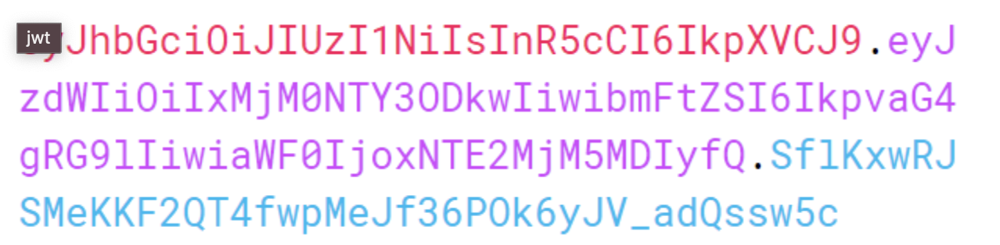
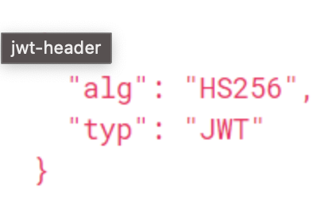
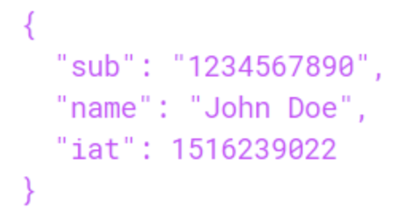
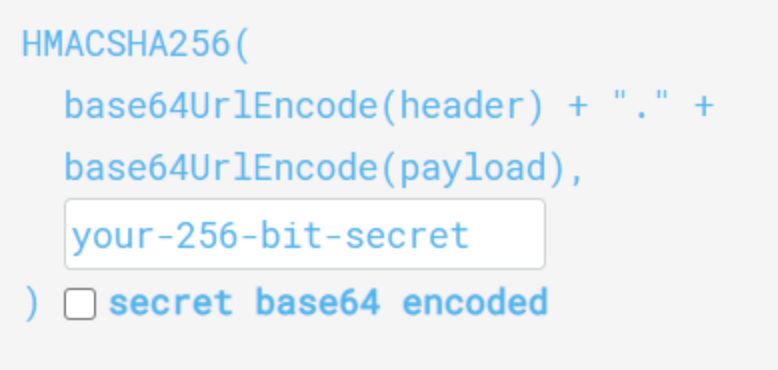

# JWT Authentication

## Appearance Background
* 서버 기반 인증 시스템을 사용할 때 발생하는 문제를 해결하기 위해서 등장
* 서버 기반 인증 시스템에는 쿠키/세션을 사용하는 방법이 있음
* 이 방식들은 보안 문제, 서버의 성능 저하 문제등이 존재함.

## JWT (Jason Web Token)
JWT란 인증에 필요한 정보를 암호화 시킨 Token을 의미 합니다.
쿠키/세션 인증 방식과 유사하게 토큰을 HTTP 헤더에 실어 서버가 클라이언트를 식별합니다.
### JWT의 구조

JWT는 마침표(.)를 구분자로 가지는 세가지 문자열의 조합입니다.
실제 디코딩된 JWT는 다음과 같은 구조를 가집니다.
1. Header<br>
   
   <p align="center"></p>
   
   <br>
   Header는 해싱 알고리즘 및 토큰의 타입을 지정합니다.
2. Payload<br>
   <br>
    Payload는 토큰에 담으 정보를 기억합니다.
    주로 클라이언트의 고유 ID값 및 유효기간 등이 포함되는 영역입니다.
    **Key-Value 형식으로 이루어진 한 쌍의 정보를 *Claim*이라고 칭합니다.**  
3. Signature<br>
    <br>
    2Signature는 인코딩된 header와 payload를 더한뒤, 비밀로로 해싱하여 생성합니다.
    Header와 payload는 단순히 인코딩된 값이기 때문에 단순히 복호화 및 조작을 할 수 있지만, Signature는 서버 측에서 관리하는 비밀키가 유출되지
    않는한 복호화할 수 없습니다. 따라서 Signature는 토큰이 위변조 여부를 확인하는데 사용됩니다.
### 인증 과정

```text
{
  Authorization: <type> <access-token>  
}
```
1. 클라이언트로 로그인 요청이 들어오면, 서버는 검증 후 클라이언트의 고유 ID 등
payload에 필요한 정보들을 담습니다.
2. 비밀키를 사용하여 Access Token을 발급합니다.
3. 클라이언트는 전달받은 토큰을 저장해두고, 서버에 요청할 때 마다 토큰을 요청 헤더에
포함 시켜 요청을 전달 합니다.
4. 서버는 토큰의 Signature를 비밀키로 복호화한 다음, 위변조 여부 및 유효기간 등을 확인합니다.
5. 유효한 토큰이라면 요청에 응답합니다.

### 장점

### 단점

## Reference
* [Spring Boot JWT Tutorial](https://www.inflearn.com/course/%EC%8A%A4%ED%94%84%EB%A7%81%EB%B6%80%ED%8A%B8-jwt/dashboard)